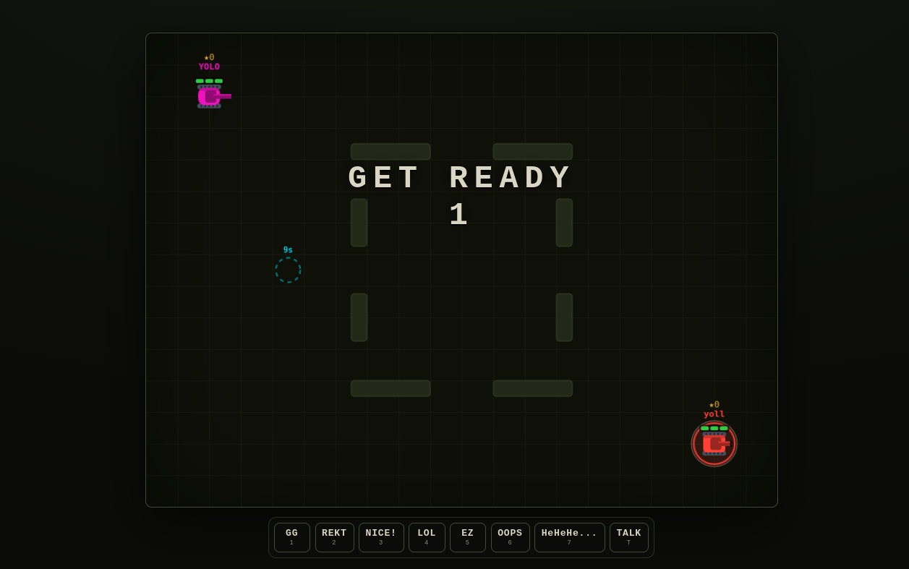
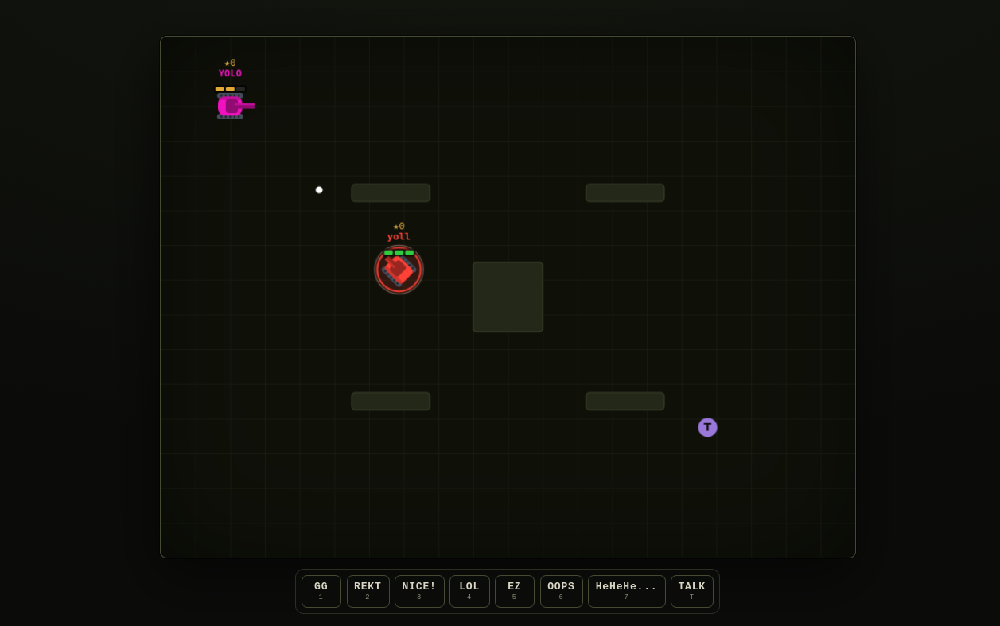
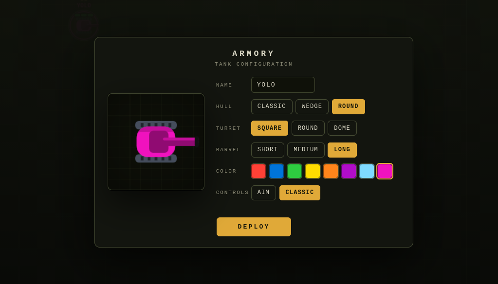
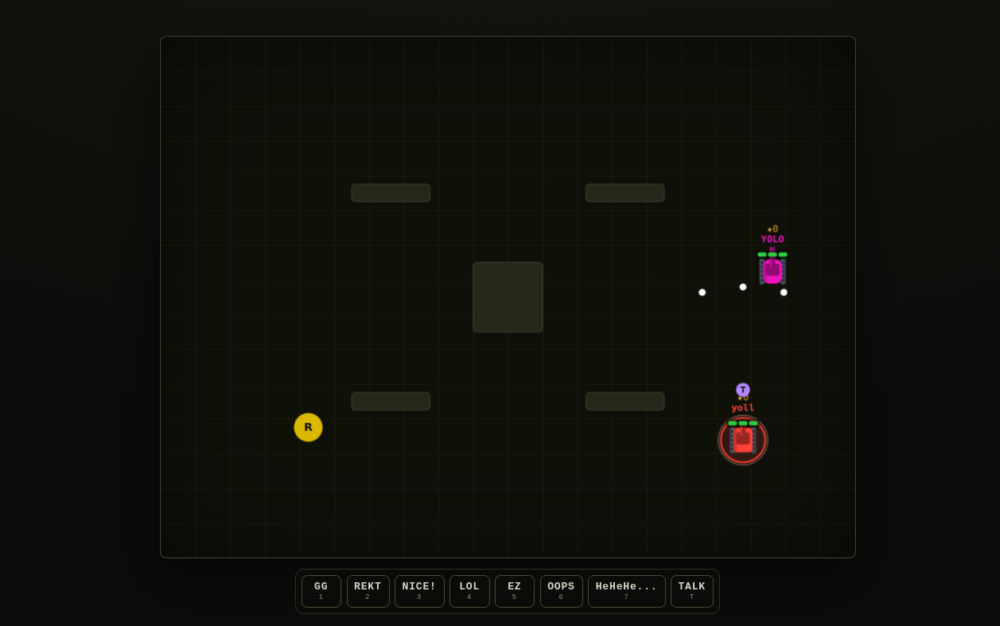

# Pixel Tank Duel

A top-down 2D local multiplayer tank shooter for 2-4 players. One device hosts the game over local Wi-Fi; everyone else joins from a browser (phone, laptop, tablet) — no internet required.

## Screenshots

| Starting screen | Gameplay |
| --- | --- |
|  |  |

| Armory | Power-ups |
| --- | --- |
|  |  |

## How it works

- One player runs the server on their machine and it acts as the host.
- Everyone else connects to the host's local IP address over the same Wi-Fi network.
- The server is authoritative: it runs the game loop (movement, shooting, collisions, round timer) at 60 updates/sec and broadcasts state to every connected browser over WebSockets.

## Gameplay

- Move with `WASD` / arrow keys (or the on-screen joystick); fire with `Space` (or the FIRE button). Optional independent aim via **Controls → Aim**.
- Customize your tank from the **Armory** (**Customize** button or `G`).
- Trash talk with `1`–`7` emotes or `T`/Enter to type; hold `Tab` for the scoreboard.
- Each round opens with a 3-2-1 countdown and 1.2 s spawn protection. Tanks have **3 HP**.
- Last tank standing wins; on the 60 s timer, most kills wins; a tie goes to sudden death.
- The match is **first to 3 round wins**. Max 4 players per game.

Full controls, maps, power-ups, bullets/collisions and feedback: **[docs/GAMEPLAY.md](docs/GAMEPLAY.md)**.

## Rooms

One server hosts many independent games at once. Each game lives in a **room** with a 4-letter code and its own arena, rounds and players — rooms never see each other.

Opening the site lands you in a **lobby**:

- **Create open room** — listed publicly; anyone can see it and join.
- **Create invite-only** — hidden from the list; only people with the code or link can join.
- **Join** an open room from the list, or type a code under **Join by code**.
- A shared link (`http://HOST:3000/?room=CODE`) skips the lobby and drops you straight in.

Each room holds up to **4 players**; full rooms show **Full** and reject new arrivals. A room disappears shortly after everyone leaves. Progress is **not** per-room: your bolts, cosmetics and streaks follow your device everywhere.

### Lobby API

The lobby talks to the server over plain HTTP; the game itself uses the WebSocket.

| Method | Path | Purpose |
| --- | --- | --- |
| `GET` | `/api/rooms` | List open rooms: `{ rooms: [{ code, players, max, state }] }`. Invite-only rooms are omitted. |
| `POST` | `/api/rooms` | Create a room. Body `{ "visibility": "open" \| "private" }` → `{ code, visibility }`. |

Joining is a WebSocket connection to `/?room=CODE`. An unknown code replies `{ "type": "notfound" }` and closes (the client returns to the lobby); a full room replies `{ "type": "full" }`.

## Customize your tank

Before a match (and any time mid-game), open the **Armory**. Set a callsign (required, up to 4 characters), then pick a hull, turret, barrel length and color, and hit **Deploy** — you can't deploy until a callsign is entered. Your callsign shows above your tank and your design is saved in the browser and shared with everyone in the match over WebSockets. Parts are purely cosmetic — they don't change speed, hitbox or damage.

The Armory also has a **Controls** toggle: **Classic** (default) makes the turret point wherever you drive and keeps the touch FIRE button, while **Aim** gives you an independent turret (mouse on desktop, right aim-stick on touch).

## Systems

- **Bolt economy & The Forge** — earn ⚡ in battle, spend it on cosmetics and consumables. See **[docs/ECONOMY.md](docs/ECONOMY.md)**.
- **Haunts** — keep losing and your own browser fights back. See **[docs/HAUNTS.md](docs/HAUNTS.md)**.
- **Persistence** — progress is tied to an account reached by a device token in `localStorage`, so there's no login. Link extra devices from the Armory's **Devices** panel. See **[docs/ECONOMY.md#persistence](docs/ECONOMY.md#persistence)** and **[docs/ACCOUNTS.md](docs/ACCOUNTS.md)**.

## Run it

```bash
npm install
npm start
```

Server starts on port 3000.

## Play over Wi-Fi

1. Start the server on the host machine (`npm start`).
2. Find the host machine's local IP address on the Wi-Fi network:
   - **Windows:** `ipconfig` → look for `IPv4 Address` (e.g. `192.168.1.15`)
   - **Mac/Linux:** `ifconfig` or `ip a` → look for `192.168.x.x`
3. On the host machine, open `http://localhost:3000`.
4. On every other device connected to the **same Wi-Fi**, open `http://YOUR_LOCAL_IP:3000` (e.g. `http://192.168.1.15:3000`).

Open the site and use the **lobby**: **Create open room** lets anyone join, **Create invite-only** keeps it private. Share the `?room=CODE` link (or the code) with your friends. Up to 4 players per room; different codes run separate games on the same server.

All devices must be on the same local network — this does not work over the open internet without extra setup (see below).

## Deploying off the local network

This game needs a persistent Node process holding live game state in memory and pushing it over WebSockets at 60Hz — it is **not compatible with serverless platforms** (Vercel, Netlify Functions, etc.), which spin functions up per-request and don't keep in-memory state or long-lived sockets alive between calls.

Run it on any host that keeps a persistent Node process with WebSocket support:

- Any VPS (DigitalOcean, Linode, etc.) running `npm start` behind a process manager (pm2, systemd)
- Railway
- Render
- Fly.io
- Or your own machine, exposed with a tunnel (see below)

The app has no other infra requirements — no database, no build step. Just `npm install && npm start`.

On a systemd host, restart the service after code changes with `sudo systemctl restart pixel-tank`. Editing `public/index.html` alone needs no restart — just reload the browser. See [HOSTING.md](HOSTING.md) for the full setup.

### Configuration

| Env var | Default | Purpose |
| --- | --- | --- |
| `PORT` | `3000` | TCP port to listen on |
| `HOST` | `0.0.0.0` | Bind address (all interfaces) |
| `PTD_DEBUG` | unset | Test-only debug seam; any non-empty value enables `dbg_kill` ws messages. Useful for headless testing — leave unset in production |

```bash
PORT=4000 HOST=127.0.0.1 npm start
```

## Reaching it from outside the LAN

Home networks sit behind NAT, so the LAN URL only works on the same Wi-Fi. The easy way out is a **Cloudflare Tunnel**: `cloudflared` runs on the host and makes an **outbound-only** connection to Cloudflare's edge, publishing the game at a public HTTPS hostname — no port-forwarding, no static IP, no DDNS.

1. Install `cloudflared` on the host and create a tunnel (see [HOSTING.md](HOSTING.md)).
2. Add a **public hostname** route: `game.<your-domain>` → `http://localhost:3000`.
3. Share `https://game.<your-domain>` — WebSockets pass through the tunnel as-is.

Nothing listens on the internet at your host, so there are no firewall ports to open. The tunnel is public, so gate it with **Cloudflare Access** if you want it private.

Full walkthrough, verification and troubleshooting: **[HOSTING.md](HOSTING.md)**.

## Project structure

```
server.js          Server wiring: HTTP/static + WebSocket + room dispatch
lib/               Game modules (config, catalog, design, bank, room, rooms, ratelimit)
public/index.html  Client: canvas renderer, input handling, HUD
data/              Persisted player banks (players.json, auto-created)
docs/              Gameplay, economy, haunt and account documentation
assets/            README screenshots
deploy/            systemd unit (see HOSTING.md)
```
